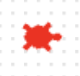

<h2 class="c-project-heading--task">Set the turtle colour</h2>

--- task ---
Set the turtle’s colour using 

  red, green, and blue values
.  
Each colour value can be between `0` and `255`.
--- /task ---

--- code ---
---
language: python
filename: main.py
line_numbers: true
line_number_start: 1
line_highlights: 6-7
---

from turtle import *          # Import turtle graphics tools
from random import *          # Import random number tools

colormode(255)                # Use RGB colour values from 0–255

color(255, 0, 0)              # Set colour value to 255,0,0 = Red
shape("turtle")               # Set shape to Turtle

--- /code ---

--- task ---

**Test**: Run your code and check the output.  
A turtle should appear on the screen in the colour you set using the RGB values.

--- /task ---

<pre>

  </pre>

### Tip

- Red, green, and blue (RGB) values range from 0 to 255 – using numbers outside this range will give an error
- Changing the numbers changes the colour – have a play with them and run the code again!

