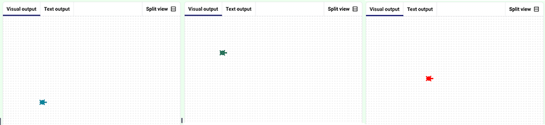

<h2 class="c-project-heading--task">Move the turtle to a random place</h2>

Move the turtle to a random position on the screen.

<h2 class="c-project-heading--explainer">Follow these instructions</h2>

The centre of the screen is at `(0, 0)`.
You can move the turtle to a random x and y position.

--- code ---
---
language: python
filename: main.py
line_numbers: true
line_number_start: 1
line_highlights: 12-17,20
---

from turtle import *          # Import turtle graphics tools
from random import *          # Import random number tools

colormode(255)                # Use RGB colour values from 0-255

def randomcolour():           # Function to set a random turtle colour
    red = randint(0, 255)           # Pick a random red value
    green = randint(0, 255)         # Pick a random green value
    blue = randint(0, 255)          # Pick a random blue value
    color(red, green, blue)         # Set the turtle colour

def randomplace():            # Function to move the turtle to a random position
    penup()                   # Lift the pen so no line is drawn
    x = randint(-100, 100)    # Pick a random x coordinate
    y = randint(-100, 100)    # Pick a random y coordinate
    goto(x, y)                # Move to the random position
    pendown()                 # Put the pen back down

randomcolour()                # Choose a random colour
randomplace()                 # Move to a random place
shape("turtle")               # Set shape to Turtle

--- /code ---

### Debugging

- If lines appear, check `penup()` and `pendown()`
- If the cursor is an arrow, check where `shape("turtle")` is called

## Now run your code

Each time you run the code, the turtle should appear in a different place and a different colour, without drawing any lines.

  

