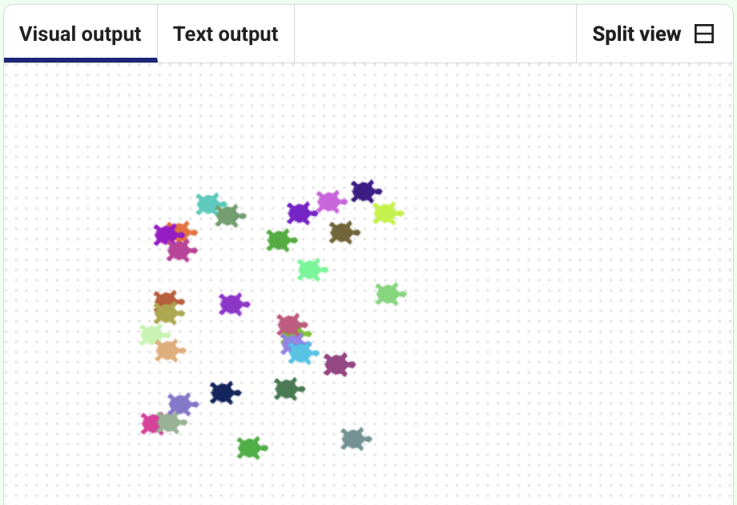

<h2 class="c-project-heading--task">Create turtle stamp art</h2>

Use stamps and a **loop** to create turtle art.

The `stamp()` command leaves a copy of the turtle on the screen. By putting it inside a **loop**, you can make lots of turtle stamps at once.

--- code ---
---
language: python
filename: main.py
line_numbers: true
line_number_start: 1
line_highlights: 21-25
---

from turtle import *          # Import turtle graphics tools
from random import *          # Import random number tools

colormode(255)                # Use RGB colour values from 0-255

def randomcolour():           # Function to set a random turtle colour
    red = randint(0, 255)           # Pick a random red value
    green = randint(0, 255)         # Pick a random green value
    blue = randint(0, 255)          # Pick a random blue value
    color(red, green, blue)         # Set the turtle colour

def randomplace():            # Function to move the turtle to a random position
    penup()                   # Lift the pen so no line is drawn
    x = randint(-100, 100)    # Pick a random x coordinate
    y = randint(-100, 100)    # Pick a random y coordinate
    goto(x, y)                # Move to the random position
    pendown()                 # Put the pen back down

shape("turtle")               # Set shape to Turtle

for i in range(30):           # Repeat 30 times
    randomcolour()                  # Choose a random colour
    randomplace()                   # Move to a random place
    stamp()                         # Stamp the turtle shape

--- /code ---

## Now run your code

You should see many turtle shapes stamped in different places and colours across the screen.

  

