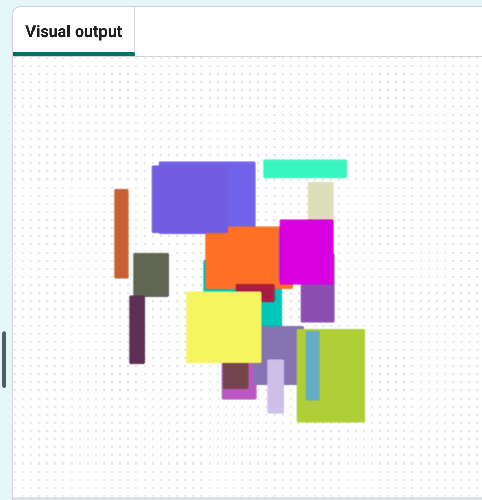

<h2 class="c-project-heading--task">Draw modern art with rectangles</h2>

Replace turtle stamps with randomly sized rectangles.

<h2 class="c-project-heading--explainer">Follow these instructions</h2>

You can turn your turtle art into modern art by drawing rectangles instead. **Comment out** the lines of code you don't need, and add some instructions for rectangles.

### Tip

Commenting out means telling the computer to ignore a line of code without deleting it.
In Python, you do this by putting a # at the start of the line.

--- code ---
---
language: python
filename: main.py
line_numbers: true
line_number_start: 1
line_highlights: 19-25, 27-44,46-47
---

from turtle import *          # Import turtle graphics tools
from random import *          # Import random number tools

colormode(255)                # Use RGB colour values from 0-255

def randomcolour():            # Function to set a random turtle colour
    red = randint(0, 255)      # Pick a random red value
    green = randint(0, 255)    # Pick a random green value
    blue = randint(0, 255)     # Pick a random blue value
    color(red, green, blue)    # Set the turtle colour

def randomplace():             # Function to move the turtle to a random position
    penup()                    # Lift the pen so no line is drawn
    x = randint(-100, 100)     # Pick a random x coordinate
    y = randint(-100, 100)     # Pick a random y coordinate
    goto(x, y)                 # Move to the random position
    pendown()                  # Put the pen back down

# Comment out the turtle stamp code by placing hashtags at the beginning of each line you don't want
# shape("turtle")             # Set the turtle shape

# for i in range(30):          # Repeat 30 times
#     randomcolour()           # Choose a random colour
#     randomplace()            # Move to a random place
#     stamp()                  # Stamp the turtle shape

def draw_rectangle():          # Function to draw a random-sized rectangle:
    randomcolour()                  # Choose a random colour
    randomplace()                   # Move to a random place
    length = randint(10, 100)       # Choose a random width
    height = randint(10, 100)       # Choose a random height
    begin_fill()                    # Start filling the shape with colour
    for i in range(2):              # Draw two pairs of sides
        forward(length)                 # Draw the top/bottom edge
        right(90)                       # Turn right
        forward(height)                 # Draw the side edge
        right(90)                       # Turn right
    end_fill()                      # Finish filling the shape

for i in range(30):            # Repeat 30 times
    draw_rectangle()           # Draw a rectangle

--- /code ---

## Now run your code

The turtle stamps should be gone and replaced with many coloured rectangles of different sizes and positions.

  

