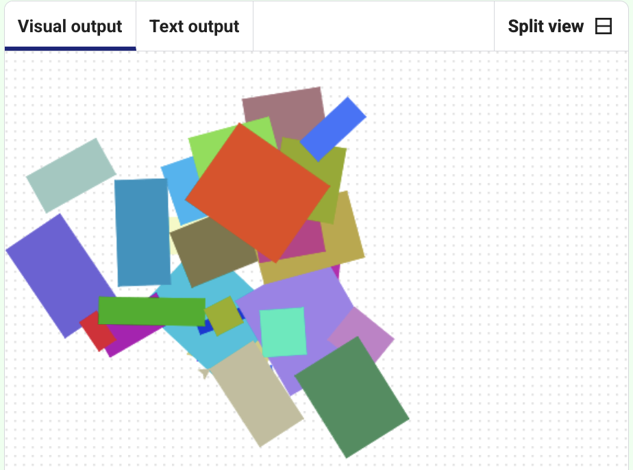

## Challenge: Rotate shapes randomly

Add random rotation to your artwork.

You can **rotate** the turtle to make the rectangles appear at different angles.

```python filename="main.py" line_numbers="true" line_number_start="1" line_highlights="27-28,35"

from turtle import *          # Import turtle graphics tools
from random import *          # Import random number tools

colormode(255)                # Use RGB colour values from 0-255

def randomcolour():            # Function to set a random turtle colour
    red = randint(0, 255)      # Pick a random red value
    green = randint(0, 255)    # Pick a random green value
    blue = randint(0, 255)     # Pick a random blue value
    color(red, green, blue)    # Set the turtle colour

def randomplace():             # Function to move the turtle to a random position
    penup()                    # Lift the pen so no line is drawn
    x = randint(-100, 100)     # Pick a random x coordinate
    y = randint(-100, 100)     # Pick a random y coordinate
    goto(x, y)                 # Move to the random position
    pendown()                  # Put the pen back down

# Comment out the turtle stamp code by placing hashtags at the beginning of each line you don't want
# shape("turtle")             # Set the turtle shape

# for i in range(30):          # Repeat 30 times
#     randomcolour()           # Choose a random colour
#     randomplace()            # Move to a random place
#     stamp()                  # Stamp the turtle shape

def randomheading():           # Function to set a random heading for the next rectangle
    setheading(randint(1, 360))     # Choose a random angle for the heading

def draw_rectangle():          # Function to draw a random-sized rectangle:
    randomcolour()                  # Choose a random colour
    randomplace()                   # Move to a random place
    length = randint(10, 100)       # Choose a random width
    height = randint(10, 100)       # Choose a random height
    randomheading()                 # Choose a random rotation
    begin_fill()                    # Start filling the shape with colour
    for i in range(2):              # Draw two pairs of sides
        forward(length)                 # Draw the top/bottom edge
        right(90)                       # Turn right
        forward(height)                 # Draw the side edge
        right(90)                       # Turn right
    end_fill()                      # Finish filling the shape

for i in range(30):            # Repeat 30 times
    draw_rectangle()           # Draw a rectangle

```

> [!TIP]
>
> - To make the drawing go faster, add `speed(0)` to your `draw_rectangle()` function and watch it go!
> - Changing the number in `range(30)` changes how many rectangles are drawn - have a play with this and run the code again!

## Now run your code

The rectangles should appear at different angles each time the program runs.


